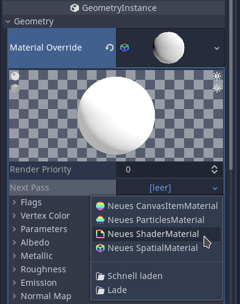

So you want to highlight an object in Godot using an outline, but how do you go about doing that?
Actually, there are many paths to that goal, and they depend a lot on what you want *exactly*.

If you want to simply highlight one specific object with an outline, that's easily done. Just apply your outline shader to it by setting it as the “Next Pass” of that object's material.

<div class="sidebysidecontainer">
    <div class="sidebyside" style="width: 33%; float: left;">
        
    </div>
    <div class="sidebyside" style="width: 33%; float: left;">
        
    </div>
    <div class="sidebyside" style="width: 33%; float: left;">
        
    </div>
</div>

If you don't know what shader you should apply to generate an outline, I encourage you to check out the “Sobel Edge Detection” or “Laplace Edge Detection” algorithms. You might want to do some processing before and after you have detected the edges for your outline, so you might also be interested in a “Gaussian Blur” and a “Maximum Filter”.
You could also just head to [Godot Shaders](https://www.godotshaders.com/) and copy a readily made one, but where's the fun in that?

The problem with applying the shader like that is: it breaks down as soon as your highlighted object is obstructed by something else! To be fair, it still shows the outline of the visible object, so that might be what you want, and if it is, then you're done here. Bye!


But I have a feeling this is not what you imagined when you were thinking of outlining your object. You might have played Left 4 Dead (or similar games) where you can always see where your teammates are, even through walls! How do they do that? Obviously our previous method cannot do that…

What you would usually do is use the “Stencil Buffer”. You can think of it as an image on which the object you are interested in is colored in white, and everything else is black. This image is created separately from the final image you see on screen, so on the stencil buffer your object would not be obstructed by other things, it is always visible on there. The second advantage of the stencil buffer is, because the whole object is colored in white, there is no detail within the object, which the edge detection can pick up on! Look at this comparison:

<div class="sidebysidecontainer">
    <div class="sidebyside" style="width: 49%; float: left;">
        
    </div>
    <div class="sidebyside" style="width: 49%; float: left;">
        
    </div>
</div>

Notice how in the first picture, the shader did not just highlight the outline, but also any edges *within* the object? Yeah, that's not nice… Using a stencil buffer will get rid of that for us!

Only problem is… Godot does not have a stencil buffer, or at least it is not exposed to us. There are two ways of solving this. 

One way I found is from [this shader](https://godotshaders.com/shader/outline-silhouette-shader/). It requires you do two passes. (So you're actually using two shaders). The first one will make sure the object is in front of everything else, but invisibly, the second pass renders the outline. (It doesn't actually use edge detection, but you could do that using the depth buffer) This works, but I would prefer not to tamper with the depth buffer.

The other way I came up with was helped along by two things: 
- Godot's excellent [Documentation](https://docs.godotengine.org/en/stable/tutorials/viewports/custom_postprocessing.html) on custom post-processing
- randomly stumbling upon [Garbaj's video](https://www.youtube.com/watch?v=9i6uxm_ioG0) on first person gun clipping in Godot.

So this is what we will do:
1. Create a viewport and viewport container for a fullscreen post-processing effect, as described by Godot's documentation.
2. Create a camera within that viewport, which only renders layer 2, as described by Garbaj.
3. Sync up the camera inside the viewport with our main camera.

Can you see where this is going yet?
Instead of applying the outline shader directly as a “next pass” on the object we want highlighted, we simply tell that object to render itself on layer 2. Now, the camera inside the viewport will only see this one object, because nothing else is rendering on layer 2. Then, we simply apply the outline shader to the image rendered by that camera. This also allows us to easily change which objects have an outline without having to assign materials.

We have just created our own stencil buffer! Well, almost…
As it stands, it will still render the object with all its detail, but we wanted it to be colored in completely white, so that the edge detection ignores edges within the object. No problem though, we can easily fix that in our edge detection shader later, but before we do that, let me show you exactly how to set this up:

0. I recommend creating a Node as a parent, this won't do anything, it will just help keep your scene tree tidy. Name it “Outlines”.
1. Create a viewport container as a child of that Node and set it to fill the screen.

    

2. Make sure the viewport container has “Stretch” enabled.

    

3. Create a Viewport as a child of the viewport container. Make sure “Transparent BG” is enabled and “Update Mode” is “Always”. I also recommend using “Debug Draw” = “Unshaded” and “Keep 3D linear”, but this is not required.

    

5. Lastly, create a camera as a child of the viewport. The only important setting is “Cull Mask”. Set it to which ever layer you want to use (make sure it uses *only* that layer!). You should also make sure that the FOV is synced up with your main camera, but you can do that in the script too.

    

You will also need to sync up the shader camera with your real camera. This is easily done. In my case, I attached the script to the “Outlines” Node (step 1), but you could also attach it to the viewport camera (in this case, use `self.global_transform` instead of `shader_camera.global_transform`).
```gdscript
extends Node

onready var external_camera := get_viewport().get_camera()  # real camera
onready var shader_camera := find_node("Camera") as Camera  # shader camera

func _process(_delta: float) -> void:
    shader_camera.global_transform = external_camera.global_transform
```

We're not done with the setup yet, we still need to tell the object we want to highlight to render on layer 2, so our viewport camera can see it. You can either:
- do it from code: `mesh_instance.set_layer_mask_bit(1, true)` Important: layer bit 1 = layer 2, don't run into off-by-one errors here. If you want to stop your object from having outlines, you can just remove it from layer 2 again: `mesh_instance.set_layer_mask_bit(1, false)`.
- or set your mesh instance (or anything inheriting `VisualInstance`) to render on layer 2 in the inspector


Now we are pretty much done, the only thing left is the shader itself!
Select the Viewport Container again, and in the inspector, find its material, assign a new shader material, and load your shader.


Because we are processing a viewport, make sure to use `TEXTURE` and `UV` instead of `SCREEN_TEXTURE` and `SCREEN_UV`. You can also skip any conversions for getting screen pixel coordinates. For example, here is my Laplace Edge Detection Shader:
```glsl
shader_type canvas_item;

uniform vec4 highlight_color: hint_color = vec4(1.0, 0.0, 0.0, 1.0);

void fragment() {
    vec4 laplace;
    laplace  =  8.0 * texture(TEXTURE, UV);
    laplace += -1.0 * texture(TEXTURE, UV + vec2(-SCREEN_PIXEL_SIZE.x, -SCREEN_PIXEL_SIZE.y));
    laplace += -1.0 * texture(TEXTURE, UV + vec2(-SCREEN_PIXEL_SIZE.x, SCREEN_PIXEL_SIZE.y));
    laplace += -1.0 * texture(TEXTURE, UV + vec2(SCREEN_PIXEL_SIZE.x, -SCREEN_PIXEL_SIZE.y));
    laplace += -1.0 * texture(TEXTURE, UV + vec2(SCREEN_PIXEL_SIZE.x, SCREEN_PIXEL_SIZE.y));
    laplace += -1.0 * texture(TEXTURE, UV + vec2(SCREEN_PIXEL_SIZE.x, 0.0));
    laplace += -1.0 * texture(TEXTURE, UV + vec2(-SCREEN_PIXEL_SIZE.x, 0.0));
    laplace += -1.0 * texture(TEXTURE, UV + vec2(0.0, SCREEN_PIXEL_SIZE.y));
    laplace += -1.0 * texture(TEXTURE, UV + vec2(0.0, -SCREEN_PIXEL_SIZE.y));
    
    if(abs(laplace.x) < 0.001) {  // == 0
        discard; 
    } else { 
        COLOR = highlight_color; 
    }
}
```

But wait! This will still detect detail within the object. I told you before there is a simple fix, and there really is. We simply replace the `texture()` call in the shader by a new function I called `tex_bin()`, because it does the same as `texture()`, but it will only return binary values, 1 or 0.
```glsl
float tex_bin(sampler2D tex, vec2 uv) {
    vec3 rgb = texture(tex, uv).xyz;
    if(rgb == vec3(0)) { // not part of the object
        return 0.0;         // then color it black
    } else {             // part of the object
        return 1.0;         // then color it white
    }
}
```
This is the reason it is important your Viewport has “Transparent BG” enabled, the `rgb == vec3(0)` check will not work otherwise.

So our final shader looks like:
```glsl
shader_type canvas_item;

uniform vec4 highlight_color: hint_color = vec4(1.0, 0.0, 0.0, 1.0);

float tex_bin(sampler2D tex, vec2 uv) {
    vec3 rgb = texture(tex, uv).xyz;
    if(rgb == vec3(0)) {
        return 0.0;
    } else {
        return 1.0;
    }
}

void fragment() { 
    float laplace;
    
    laplace  =  8.0 * tex_bin(TEXTURE, UV);
    laplace += -1.0 * tex_bin(TEXTURE, UV + vec2(-SCREEN_PIXEL_SIZE.x, -SCREEN_PIXEL_SIZE.y));
    laplace += -1.0 * tex_bin(TEXTURE, UV + vec2(-SCREEN_PIXEL_SIZE.x, SCREEN_PIXEL_SIZE.y));
    laplace += -1.0 * tex_bin(TEXTURE, UV + vec2(SCREEN_PIXEL_SIZE.x, -SCREEN_PIXEL_SIZE.y));
    laplace += -1.0 * tex_bin(TEXTURE, UV + vec2(SCREEN_PIXEL_SIZE.x, SCREEN_PIXEL_SIZE.y));
    laplace += -1.0 * tex_bin(TEXTURE, UV + vec2(SCREEN_PIXEL_SIZE.x, 0.0));
    laplace += -1.0 * tex_bin(TEXTURE, UV + vec2(-SCREEN_PIXEL_SIZE.x, 0.0));
    laplace += -1.0 * tex_bin(TEXTURE, UV + vec2(0.0, SCREEN_PIXEL_SIZE.y));
    laplace += -1.0 * tex_bin(TEXTURE, UV + vec2(0.0, -SCREEN_PIXEL_SIZE.y));
    
    if(abs(laplace) < 0.001) {  // == 0
        discard; 
    } else { 
        COLOR = highlight_color; 
    }
}
```

Final results:

<div class="sidebysidecontainer">
    <div class="sidebyside" style="width: 49%; float: left;">
        
    </div>
    <div class="sidebyside" style="width: 49%; float: left;">
        
    </div>
</div>

One more thing: notice how the outline is breaking apart into individual squares around the thin overhead line? This is unfortunately a weakness of edge detection that we can't do anything about. (Well, you could use a different approach) Because it works on the final rendered image, not on the actual geometry, very thin edges just don't have enough resolution for the edge detection to realise there is actually an edge there.